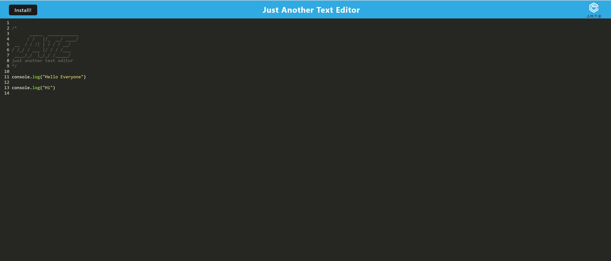
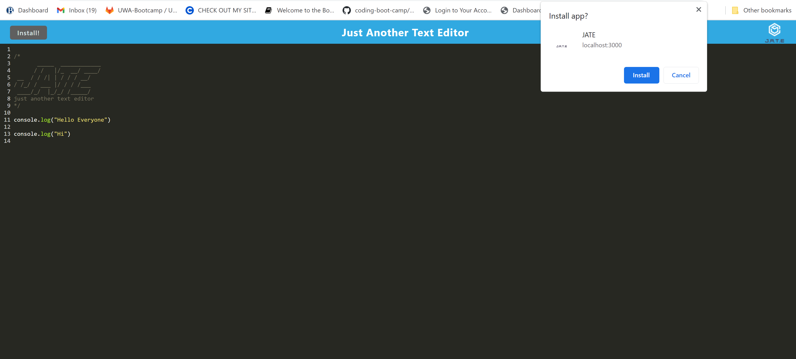
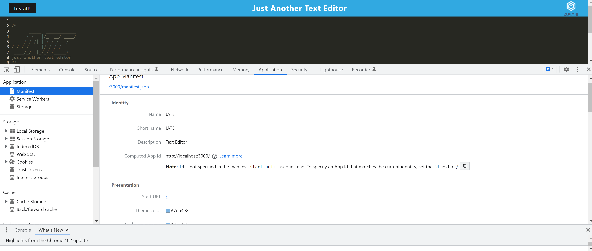
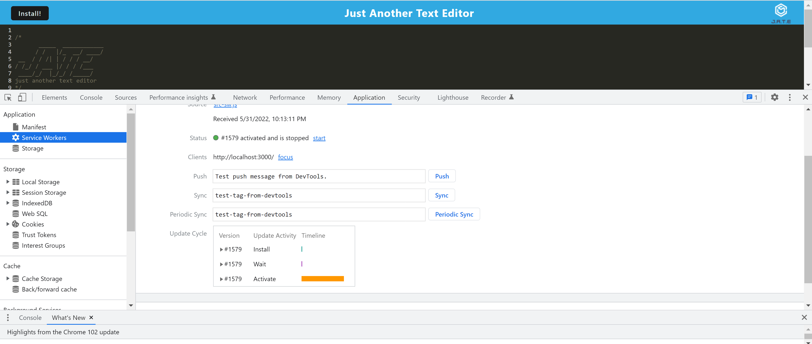
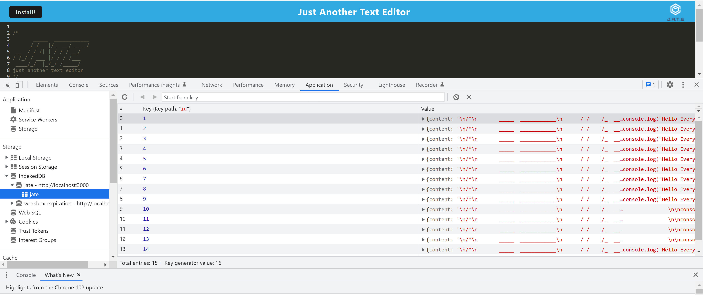

# Text-Editor 


    ## Table of Contents:

    1. Descriptions
    2. Installation
    3. Usage
    4. Contribution
    5. Test
    6. License
    7. Github
    8.Question
    1. Email

 ## Description 
WHEN you open my application in your editor
THEN you should see a client server folder structure
WHEN you run `npm run start` from the root directory
THEN you find that my application should start up the backend and serve the client
WHEN you run the text editor application from your terminal
THEN you find that my JavaScript files have been bundled using webpack
WHEN you run my webpack plugins
THEN you find that I have a generated HTML file, service worker, and a manifest file
WHEN you use next-gen JavaScript in my application
THEN you find that the text editor still functions in the browser without errors
WHEN you open the text editor
THEN you find that IndexedDB has immediately created a database storage
WHEN you enter content and subsequently click off of the DOM window
THEN you find that the content in the text editor has been saved with IndexedDB
WHEN you reopen the text editor after closing it
THEN you find that the content in the text editor has been retrieved from our IndexedDB
WHEN you click on the Install button
THEN you download my web application as an icon on my desktop
WHEN you load my web application
THEN you should have a registered service worker using workbox
WHEN you register a service worker
THEN you should have my static assets pre cached upon loading along with subsequent pages and static assets
WHEN you deploy to Heroku
THEN you should have proper build scripts for a webpack application

## Installation 
 To run this application you need to install all dependencies by 
 ```sh
 npm install or npm i
 ```

 ## Usage 

 To run the program, use the command 
 ```sh
npm run start or
npm run start:dev
 ```

 * Application images
  
  
  
  
  

 * Live demo
  
  

## Contibution
NA

 ## Test
This application doesn't have the test

## License
MIT License
Copyright MIT  


Permission is hereby granted, free of charge, to any person obtaining a copy of this software and associated documentation files (the "Software"), to deal in the Software without restriction, including without limitation the rights to use, copy, modify, merge, publish, distribute, sublicense, and/or sell copies of the Software, and to permit persons to whom the Software is furnished to do so, subject to the following conditions:
The above copyright notice and this permission notice shall be included in all copies or substantial portions of the Software.
THE SOFTWARE IS PROVIDED "AS IS", WITHOUT WARRANTY OF ANY KIND, EXPRESS OR IMPLIED, INCLUDING BUT NOT LIMITED TO THE WARRANTIES OF MERCHANTABILITY, FITNESS FOR A PARTICULAR PURPOSE AND NONINFRINGEMENT. IN NO EVENT SHALL THE AUTHORS OR COPYRIGHT HOLDERS BE LIABLE FOR ANY CLAIM, DAMAGES OR OTHER LIABILITY, WHETHER IN AN ACTION OF CONTRACT, TORT OR OTHERWISE, ARISING FROM, OUT OF OR IN CONNECTION WITH THE SOFTWARE OR THE USE OR OTHER DEALINGS IN THE SOFTWARE.
    
## Github
For Any question or request you can to on my [Github](https://github.com/Abou2022)

## Question
For any question you can contact me by email. Thank you for any future contribution.

## Email
For any question, you can eamil at : 
[email](mailto:syllabakary2002@gmail.com)
    